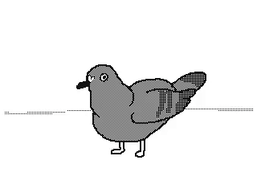

Markdown 장단점
--------------
### 장점
#### 1. 간결하다
#### 2. 별도 도구 없이 작성가능
#### 3. 텍스트 파일이기 때문에 용량이 적고 변경이력 관리 용이

### 단점
#### 1.표준이 없고, 모든 HTML 마크업을 대신하지 못함

가이드: [마크다운 가이드](https://namu.wiki/w/%EB%A7%88%ED%81%AC%EB%8B%A4%EC%9A%B4)

- - -

# test-1
깃 허브 사용법 연습중

엔터 2번은 줄바꿈
마크다운 문법을 활용하여 내용 작성

# 1단계 제목 (h1)
* 목록1
  * 목록1-1
  * 목록1-2
* 목록2
  + 목록2-1
  + 목록2-2
* 목록3
  - 목록3-1
  - 목록3-2
* 목록4

## 2단계 제목 (h2)
1. 목록1
2. 목록2
3. 목록3
4. 목록4

**굵게** 또는 __굵게__ 작성

*기울게* 또는 _기울게_ 작성

***굵게기울게*** 또는 ___굵게기울게___ 작성

~~취소~~

* * *

소스코드 작성시 백팁(backtick) 사용

다음 코드는 `print('hello')~` 파이썬 코드입니다.

여러 줄 코드 작성시
```
a = "hello"
print(a)
```
*****
이미지 넣기



* * *

> 인용문 연습중
> > 인용문 연습중2
> > > 인용문 연습중3

가로줄 넣는 문법
* * *
***
*****
- - -
----------

